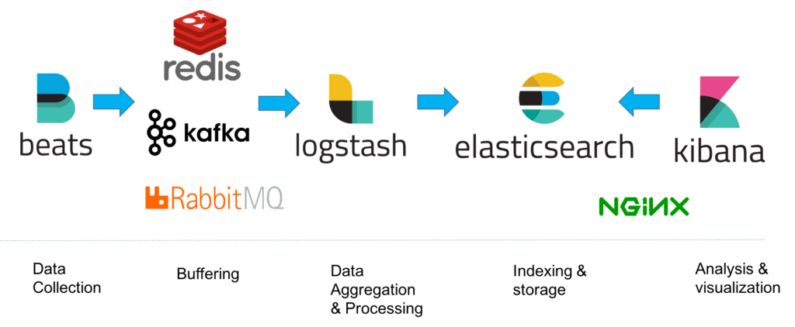

# 4 - Storing and Processing data

## Preparation

Books: 23 pages, but also parts of CIP 7!

* [x] CIP 4 A Data-Centric Approach to Security Monitoring 23   
* [ ] Skim read: CIP 7 Tools of the Trade 57, need to know NetFlow, DNS, and HTTP proxy logs in the real-world   
* [ ] Skim read: DDS 8. Breaking Up with Your Relational Database 25   

### Notes and question re: Preparation

Kramse-udvalgt citat fra CIP 4:

  > You could buy a **bunch of expensive gear**, point it all to a **log management** or a **security incident and event management (SIEM)** system, and let it automatically tell you what it knows. Some incident response teams may start this way, but unfortunately, many never evolve. **Working only with what the SIEM tells you**, versus what you have configured it to tell you based on **your contextual data**, will invariably fail. Truly demonstrating value from security monitoring and incident response **requires a major effort**. As with all projects, **planning** is the most important phase. **Designing** an approach that works best for you requires significant effort up front, but offers a great payout later in the form of **meaningful incident response and overall improved security**.

Kramse-udvalgte pointer fra CIP 7:

  > Defense in Depth – we will never catch everything
  > - Log Management: The Security Event Data Warehouse
  > - Intrusion Detection Isn’t Dead
  > - DNS, the One True King – Logging and analyzing DNS transactions, Blocking DNS requests or responses
  > - HTTP Is the Platform: Web Proxies – Web proxies allow you to solve additional security problems
  > - Rolling Packet Capture – In a perfect world, we would have full packet capture everywhere

## Noter fra undervisningen

Kramse-citat: Indbryderen skal bare finde et hul; blue team skal dække *alt* af.
Mit svar: Blue team skal bare være heldige een gang; indbryderen skal undgå *alle* blue teams alarmer.

CIP 7 fortsat: Cyber Kill Chain.

Springer lidt let hen over Relational Data Bases. Lyder som om Kramse mener det er "dated tech" for log management.

### Værktøjer - SIEM komponenter

- Archime - Full Packet Capture (slide nr. 12)
- ElastiFlow - Visualisering af netflow / sFlow
- HELK - Beskrivelse af de forskellige dele
- Wasuh - Monitorering af systemer
- OSQuery - Lave forespørgsler ud på klienter
- Elasticsearch - a search engine based on the Lucene library. It provides a distributed, multitenant-capable full text search engine

Elastic SIEM Architecture slide 33

**Slide 4**: Bemærk Redis queue til opsamling af data.

